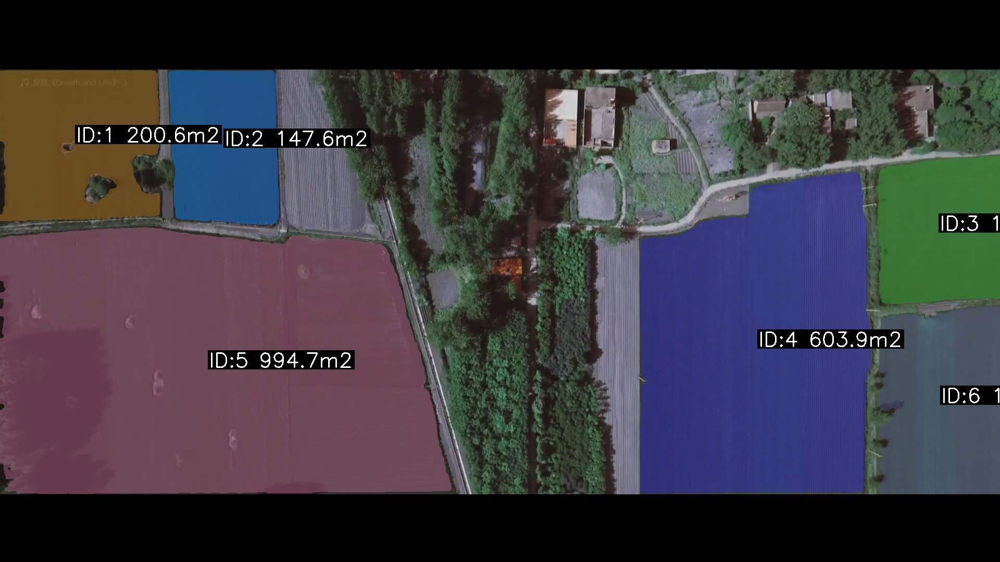
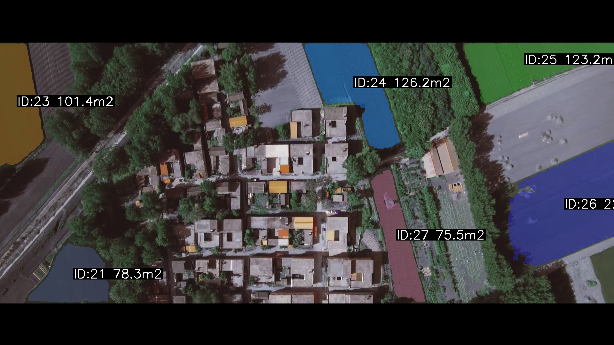

# 🌾 无人机农田面积智能估算系统

> 基于 **Meta SAM2** 的无人机航拍视频农田识别分割与面积计算系统。
> 输入一段无人机视频，交互式标注第一帧，系统自动完成全程追踪分割并输出各地块面积。

---
## 🎥 效果演示

### 左右分屏对比（原图 vs SAM2 追踪）
<video src="assets/demo_comparison.mp4" controls width="100%"></video>

### 分割结果示例



## 功能特性

| 功能 | 说明 |
|------|------|
| 🖱️ 交互式标注 | 基于 SAM2 的点击式农田标注，左键正样本、右键负样本，`S` 预览，`Enter` 确认 ，`Q` 退出|
| 🔀 联合掩码追踪 | 将多块标注合并为联合掩码注入 SAM2 Video Predictor，覆盖第一帧所有农田 |
| ✂️ 连通域拆分 | 形态学处理 + 连通域分析，自动将整体掩码拆分为各独立地块 |
| 📐 物理面积计算 | 解析大疆 XMP 元数据，基于 GSD 公式换算真实面积（平方米/亩） |
| 🛡️ 时序滤波 | 自动过滤追踪碎斑导致的面积突变 |
| 📊 可视化看板 | Streamlit 交互式面板，支持时序面积趋势图、各地块柱状图、逐帧数据明细 |
| 🎬 对比视频 | 生成原始帧与分割结果左右分屏对比视频 |


## 环境要求

- Python >= 3.10

### 安装依赖

```bash
# 1. 安装 PyTorch（按你的 CUDA 版本选择）
pip install torch torchvision

# 2. 安装 SAM2（Meta 官方）
pip install git+https://github.com/facebookresearch/sam2.git

# 3. 安装其余依赖
pip install opencv-python streamlit pandas requests exifread
```

### 下载模型权重

```bash
# 在项目根目录新建 weights 文件夹，手动下载权重：
# https://dl.fbaipublicfiles.com/segment_anything_2/092824/sam2.1_hiera_small.pt
# 放入 weights/ 目录
```

---

## 项目结构

```
farmland-area-estimator/
├── config.py                    # 统一路径与参数配置（修改这里适配你的环境）
├── step1_extract_frames.py      # 视频帧提取
├── step2_interactive_label.py   # SAM2 交互式农田标注
├── step3_merge_masks.py         # 多块标注合并为联合掩码
├── step4_track_segment.py       # 视频追踪 + 连通域分割 + 面积统计
├── step5_area_calc.py           # GSD 换算真实物理面积
├── step6_make_video.py          # 生成左右分屏对比视频
├── step7_dashboard.py           # Streamlit 数据看板
├── assets/
│   ├── result_demo1.jpg       
│   └── result_demo2.jpg      # 演示：分割结果图
├── .gitignore
└── README.md
```

运行时自动生成（已被 .gitignore 排除）：

```
data/                            # 放入你的无人机 MP4 视频
weights/                         # 放入 SAM2 权重文件
frames/                          # step1 输出的抽帧图像
farm_masks/                      # step2 输出的农田 mask
masks_frame/                     # step4 输出的逐帧分割结果
locs.json / locs_union.json      # 标注坐标
area_list.json                   # 逐帧面积数据
final_report.json                # 最终汇总报告
demo_comparison.mp4              # 对比演示视频
```

---

## 使用方法

### 0. 配置路径

打开 `config.py`，将视频文件名改为你自己的：

```python
VIDEO_PATH = DATA_DIR / "你的视频文件.mp4"
```

其余路径会自动基于 `config.py` 所在目录生成，无需修改绝对路径。

---

### Step 1：提取视频帧

```bash
python step1_extract_frames.py
```

按每秒 2 帧从 MP4 提取图像，保存至 `data/frames/`。

---

### Step 2：交互式标注第一帧

```bash
python step2_interactive_label.py
```

弹出图像窗口，逐块标注农田：

| 操作 | 功能 |
|------|------|
| 左键点击 | 添加正样本点（绿色）|
| 右键点击 | 添加负样本点（红色，用于排除树木/道路）|
| `S` | 预览当前分割效果 |
| `Enter` | 确认当前农田，自动保存 mask，开始下一块 |
| `D` | 撤销上一个点 |
| `Q` | 完成全部标注，保存 locs.json 并退出 |

> **技巧**：对于边界模糊的农田，在周围非农田区域添加负样本点可显著提升精度。

---

### Step 3：合并联合掩码

```bash
python step3_merge_masks.py
```

将所有标注的农田 mask 取并集，生成 `farm_masks/farm_mask_union.png` 和 `locs_union.json`。

---

### Step 4：视频追踪 + 连通域分割

```bash
python step4_track_segment.py
```

将联合掩码注入 SAM2 Video Predictor，逐帧传播追踪，自动拆分各独立农田并记录像素面积，输出 `area_list.json` 和逐帧叠加图。

---

### Step 5：计算真实物理面积

```bash
python step5_area_calc.py
```

自动解析大疆 XMP 元数据计算 GSD，将像素面积换算为平方米/亩，输出 `final_report.json`。

> 若图像无 XMP 数据，自动使用 `config.py` 中的 `DEFAULT_GSD = 0.05`（米/像素）。

---

### Step 6：生成对比视频

```bash
python step6_make_video.py
```

生成原始帧与分割结果左右分屏的 MP4 演示视频。

---

### Step 7：启动数据看板

```bash
streamlit run step7_dashboard.py
```

浏览器自动打开交互式面板，包含：
- 时序面积变化趋势折线图
- 各独立农田最大面积柱状图
- 汇总指标（总地块数、总面积、分析帧数）
- 逐帧数据明细表

---

## 技术原理

```
无人机视频
    │
    ▼ Step1：按 2fps 抽帧
帧序列
    │
    ▼ Step2：SAM2 交互式点击分割
各地块 Mask（farm_mask_01.png … farm_mask_N.png）
    │
    ▼ Step3：取并集
联合掩码（farm_mask_union.png）
    │
    ▼ Step4：SAM2 Video Predictor 传播
              + 形态学处理
              + 连通域分析拆分
逐帧各地块像素面积（area_list.json）
    │
    ▼ Step5：XMP GSD 公式
              GSD = (飞行高度 × 传感器宽度) / (焦距 × 图像宽度)
真实物理面积（final_report.json，单位可选：㎡ / 亩）
    │
    ▼ Step6/7：可视化
对比视频 + Streamlit 看板
```

---

## 已知局限性

- SAM2 追踪基于外观相似性，无人机大幅移动后新进入画面的农田需重新在第一帧标注
- GSD 精确计算依赖大疆 XMP 元数据，非大疆设备需在 `config.py` 手动设置 `DEFAULT_GSD`
- 形状相似的相邻地块偶尔会被合并，可通过在 Step2 添加负样本点改善

---

## Tech Stack

`Python` · `PyTorch` · `Meta SAM2` · `OpenCV` · `Streamlit` · `XMP GSD 物理公式`